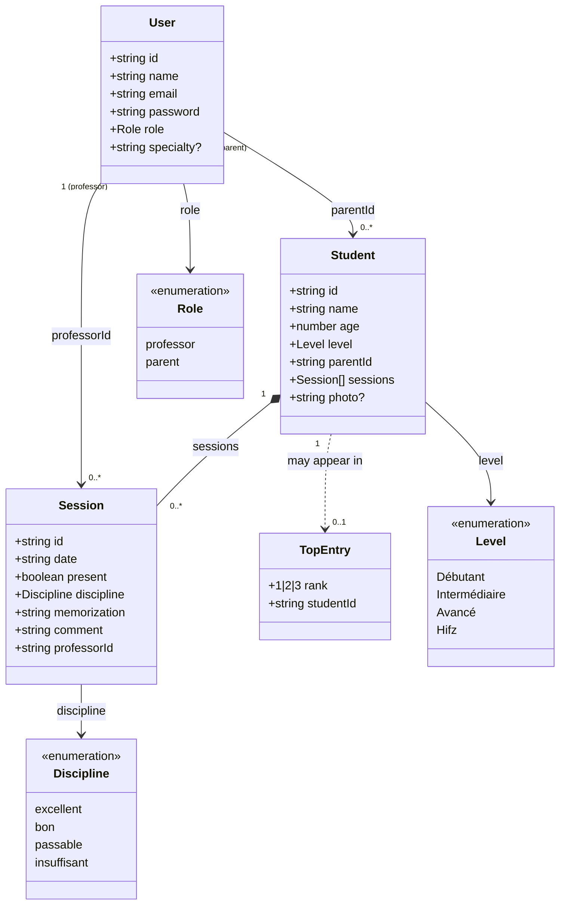
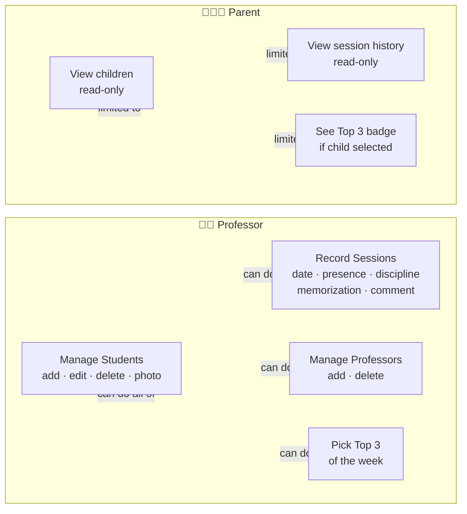
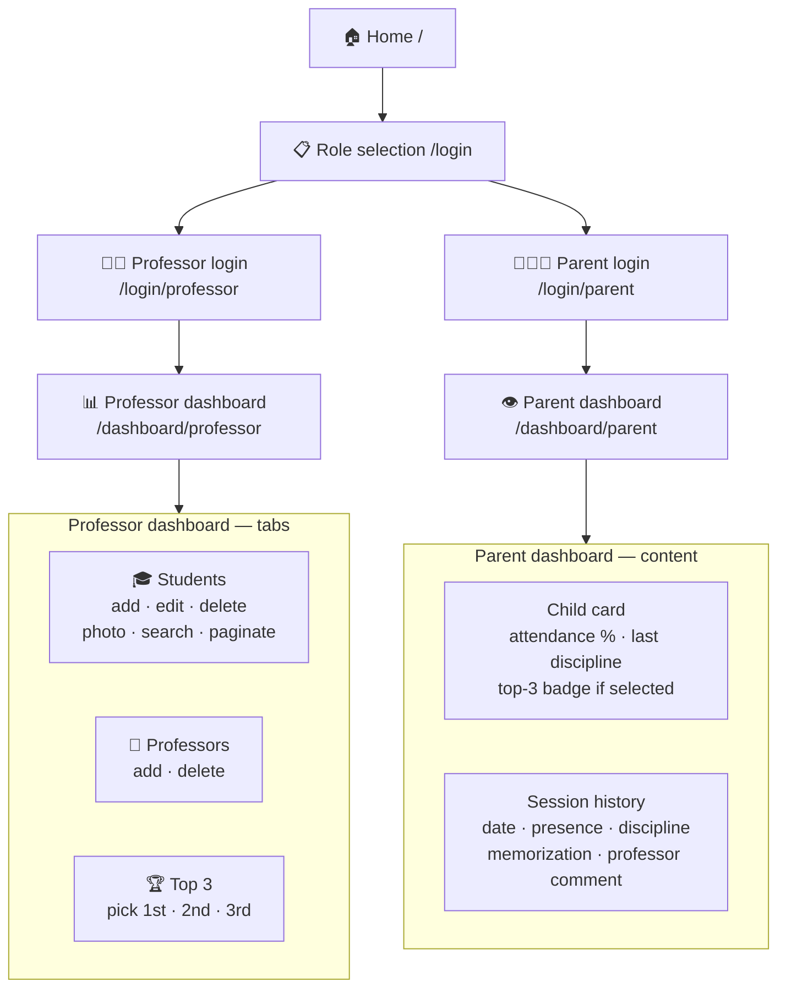
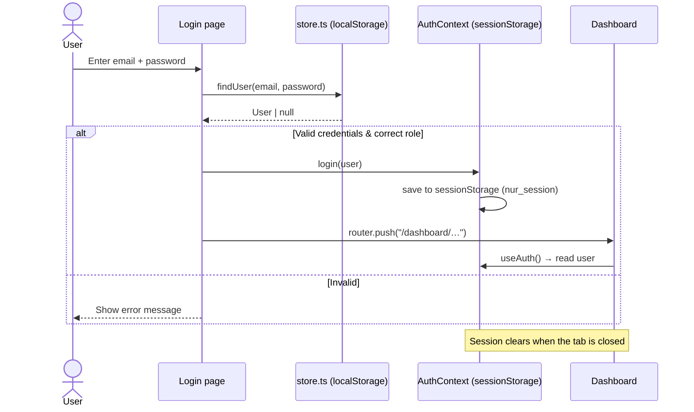

# Nur Al-Quran — Project Schema

> **How to render this file**
> - **VSCode**: install the extension *Markdown Preview Mermaid Support* → open preview (`Ctrl+Shift+V`)
> - **GitHub**: diagrams render automatically in the browser

---

## 1. Data Models



---

## 2. Roles & Permissions

### Summary table

| Action | Professor | Parent |
|---|:---:|:---:|
| View own dashboard | ✅ | ✅ |
| View all students | ✅ | ❌ |
| View own children only | ❌ | ✅ |
| Add a student | ✅ | ❌ |
| Edit a student | ✅ | ❌ |
| Delete a student | ✅ | ❌ |
| Upload student photo | ✅ | ❌ |
| Add a session | ✅ | ❌ |
| View session history | ✅ | ✅ (children only) |
| Add a professor | ✅ | ❌ |
| Delete a professor | ✅ (not self) | ❌ |
| Pick Top 3 students | ✅ | ❌ |
| See Top 3 badge | ❌ | ✅ (if child is in top 3) |
| Toggle language (AR/FR) | ✅ | ✅ |

### Permission flowchart



---

## 3. Application Navigation



---

## 4. Authentication Flow



---

## 5. Data persistence (localStorage)

| Key | Type | Description |
|---|---|---|
| `nur_users` | `User[]` | All users (professors + parents). Seeded on first load. |
| `nur_students` | `Student[]` | All students with embedded sessions. Seeded on first load. |
| `nur_top` | `TopEntry[]` | Top 3 students of the week (0–3 entries). |
| `nur_session` *(sessionStorage)* | `User` | Currently logged-in user. Cleared on tab close. |

### Seed accounts (loaded once on first visit)

| Email | Password | Role |
|---|---|---|
| `prof@nur.com` | `prof123` | professor |
| `parent@nur.com` | `parent123` | parent |

---

## 6. File structure (key files)

```
src/
├── app/
│   ├── page.tsx                      ← Home / landing page
│   ├── login/
│   │   ├── page.tsx                  ← Role selection (professor / parent)
│   │   ├── professor/page.tsx        ← Professor login form
│   │   └── parent/page.tsx           ← Parent login form
│   └── dashboard/
│       ├── professor/page.tsx        ← Professor dashboard (students · professors · top3)
│       └── parent/page.tsx           ← Parent dashboard (children · sessions)
├── components/
│   ├── Navbar.tsx
│   ├── Hero.tsx
│   ├── About.tsx
│   ├── Facilities.tsx
│   ├── Professors.tsx
│   └── TopStudents.tsx
├── context/
│   ├── AuthContext.tsx                ← useAuth() → user · login · logout
│   └── LanguageContext.tsx           ← useLanguage() → lang · dir · setLang
└── lib/
    ├── types.ts                      ← TypeScript interfaces & enums
    └── store.ts                      ← localStorage CRUD (users · students · top3)
```
