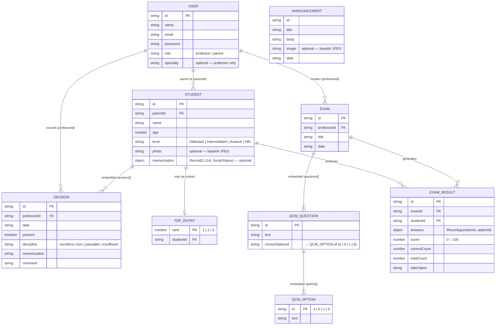
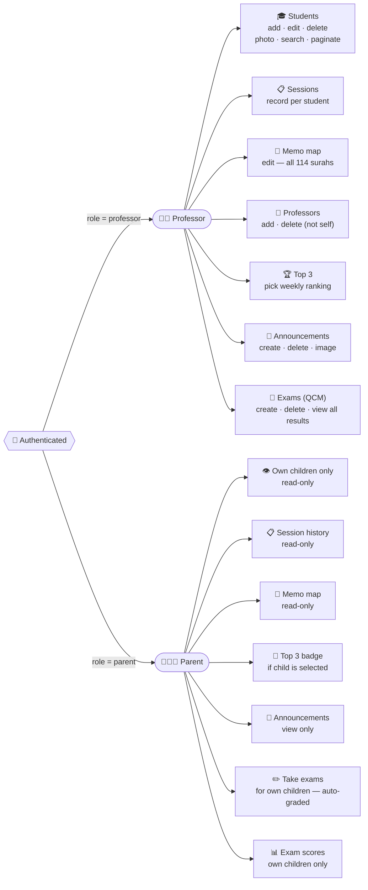
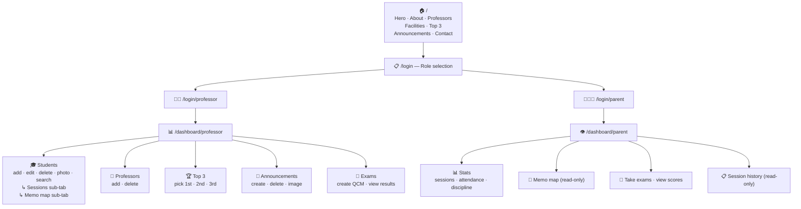
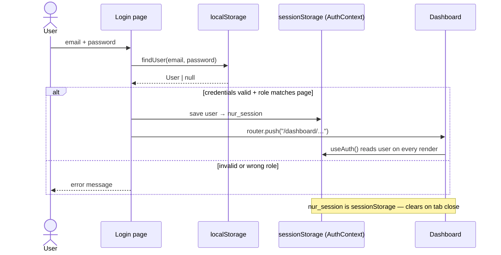

# Nur Al-Quran — Project Schema

> **Render diagrams:** VSCode → install *Markdown Preview Mermaid Support* → `Ctrl+Shift+V`  
> GitHub / GitLab render automatically.

**Stack:** Next.js 16 App Router · TypeScript · Tailwind CSS v4 · no backend — all data in `localStorage`.  
**Roles:** `professor` (full write access) · `parent` (read-only children + exam taking).

---

## 1. Entity-Relationship Diagram

> Sessions are embedded inside `STUDENT.sessions[]`.  
> Questions and options are embedded inside `EXAM.questions[].options[]`.  
> "FK" marks the field that links documents (no SQL foreign keys exist).



---

## 2. Storage Keys

| Key | Type | Seeded | store.ts functions |
|---|---|:---:|---|
| `nur_users` | `User[]` | ✅ | `getUsers` · `saveUsers` · `findUser` |
| `nur_students` | `Student[]` | ✅ | `getStudents` · `saveStudents` |
| `nur_top` | `TopEntry[]` | ❌ | `getTopStudents` · `saveTopStudents` |
| `nur_announcements` | `Announcement[]` | ✅ | `getAnnouncements` · `saveAnnouncements` |
| `nur_exams` | `Exam[]` | ❌ | `getExams` · `saveExams` |
| `nur_exam_results` | `ExamResult[]` | ❌ | `getExamResults` · `saveExamResults` |
| **`nur_session`** *(sessionStorage)* | `User` | — | `login` · `logout` — via `AuthContext` |

**Seed accounts** (written once on first visit, never overwritten):

| Email | Password | Role |
|---|---|---|
| `prof@nur.com` | `prof123` | professor |
| `parent@nur.com` | `parent123` | parent |

---

## 3. Roles & Permissions



| Feature | Action | Professor | Parent |
|---|---|:---:|:---:|
| **Auth** | Login · Logout | ✅ | ✅ |
| | Toggle language AR ↔ FR | ✅ | ✅ |
| **Students** | View all | ✅ | ❌ |
| | View own children | ❌ | ✅ |
| | Add · Edit · Delete | ✅ | ❌ |
| | Upload photo | ✅ | ❌ |
| **Sessions** | Record | ✅ | ❌ |
| | View history | ✅ | ✅ own children |
| **Memo map** | Edit | ✅ | ❌ |
| | View | ✅ | ✅ own children · read-only |
| **Professors** | Add · Delete | ✅ | ❌ |
| **Top 3** | Pick | ✅ | ❌ |
| | See badge | ❌ | ✅ if child selected |
| **Announcements** | Create · Delete | ✅ | ❌ |
| | View | ✅ | ✅ |
| | Home page | — public, no login — | |
| **Exams (QCM)** | Create · Delete | ✅ | ❌ |
| | View all results | ✅ | ❌ |
| | Take exam | ❌ | ✅ |
| | View child scores | ❌ | ✅ own children |

---

## 4. Navigation Map



---

## 5. Auth Flow



---

## 6. Exam (QCM) Flow

```mermaid
sequenceDiagram
    actor Prof as Professor
    actor Par as Parent
    participant PD as /dashboard/professor
    participant LS as localStorage
    participant ParD as /dashboard/parent

    Prof->>PD: fill title · questions · options · mark correct answers
    PD->>PD: validate (title required · ≥1 question · all texts filled)
    PD->>LS: saveExams([newExam, ...existing])

    Par->>ParD: open child card
    ParD->>LS: getExams() — exclude already-taken exams
    Par->>ParD: click "Start" → answer each question
    ParD->>ParD: auto-grade: round(correct / total × 100)
    ParD->>LS: saveExamResults([newResult, ...existing])

    Prof->>PD: Exams tab → expand any exam
    PD->>LS: getExamResults() — filter by examId
    PD-->>Prof: table: student name · correct/total · score % · date
```

---

## 7. File Structure

```
nur-al-quran/
├── SCHEMA.md                              ← this file
└── src/
    ├── app/
    │   ├── page.tsx                       Home — public landing page
    │   ├── login/
    │   │   ├── page.tsx                   Role selection screen
    │   │   ├── professor/page.tsx         Professor login form
    │   │   └── parent/page.tsx            Parent login form
    │   └── dashboard/
    │       ├── professor/page.tsx         5-tab professor dashboard
    │       └── parent/page.tsx            Per-child parent dashboard
    ├── components/
    │   ├── Navbar.tsx
    │   ├── Hero.tsx
    │   ├── About.tsx
    │   ├── Professors.tsx
    │   ├── Facilities.tsx
    │   ├── TopStudents.tsx                reads nur_top
    │   ├── AnnouncementSection.tsx        client — reads nur_announcements
    │   ├── MemoMap.tsx                    editable or read-only memo map
    │   ├── Contact.tsx
    │   └── Footer.tsx
    ├── context/
    │   ├── AuthContext.tsx                useAuth() → user · login · logout
    │   └── LanguageContext.tsx            useLanguage() → lang · dir · setLang
    └── lib/
        ├── types.ts                       all TypeScript interfaces & union types
        ├── quran.ts                       114 surahs · 30 juz · SurahStatus
        └── store.ts                       localStorage CRUD — all 6 keys
```
